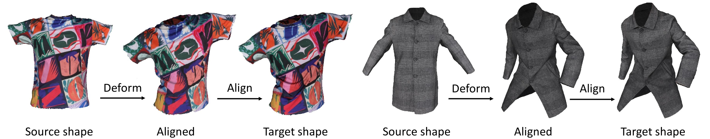

# Intrinsic Garment Alignment

### [News]

- **(2023/09/27)** Core part of the code and data released. Still working on improving usability and readability, so the code may change frequently in the next few days.

  

This repository contains the implementation of our ICCV 2023 paper:

**Leveraging Intrinsic Properties for Non-rigid Garment Alignment**

*[Siyou Lin](https://jsnln.github.io/), Boyao Zhou, [Zerong Zheng](https://zhengzerong.github.io/), [Hongwen Zhang](https://hongwenzhang.github.io/), [Yebin Liu](http://liuyebin.com/)*

[Project page](https://jsnln.github.io/iccv2023_intrinsic/index.html) | [Paper](https://arxiv.org/abs/2308.09519)

A method leveraging **intrinsic manifold properties and neural deformation fields** to achieve wrinkle-level and texture-level garment alignment.




### Data

You can download our dataset, *GarmCap*, from [here](https://cloud.tsinghua.edu.cn/f/f83a677c1fd3485b9870/?dl=1). By downloading or using the dataset, you acknowledge that you have read the following agreement, understand it, and agree to be bound by it. If you do not agree with these terms and conditions, you must not download and/or use the Dataset.

**Dataset Agreement**

1. The *GarmCap* dataset (the "Dataset") is available for **non-commercial** research purposes only. Any other use, in particular any use for commercial purposes, is prohibited. This includes, without limitation, incorporation in a commercial product, use in a commercial service, as training data for a commercial product, for commercial ergonomic analysis (e.g. product design, architectural design, etc.), or production of other artifacts for commercial purposes including, for example, web services, movies, television programs, mobile applications, or video games. The dataset may not be used for pornographic purposes or to generate pornographic material whether commercial or not. The Dataset may not be reproduced, modified and/or made available in any form to any third party without Tsinghua University’s prior written permission.
2. You agree **not to** reproduce, modify, duplicate, copy, sell, trade, resell or exploit any portion of the images and any portion of derived data in any form to any third party without Tsinghua University’s prior written permission.
3. You agree **not to** further copy, publish or distribute any portion of the Dataset. Except, for internal use at a single site within the same organization it is allowed to make copies of the dataset.
4. Tsinghua University reserves the right to terminate your access to the Dataset at any time.

### Usage

To run the code on our dataset, first download the dataset and unzip it in a new folder named `data`, structured like this:

```bash
path_to_code_repo/
	data/
		processed/
			G01/
			...
```

You also need to download the SMPL model data [here](https://smpl.is.tue.mpg.de/) (v 1.1.0), and change `smpl_folder` in the config file, e.g., `configs/g01.yaml` to the path to your downloaded SMPL data.

Finally run

```bash
python main.py configs/g01.yaml
```

Results will be outputted to these folders:

```bash
step1_eigenfuncs		# computed eigenfunctions as npz files
step1_eigenfuncs_vis	# eigenfunctions as ply files with vertex quality, for visualization
step2_posed_templates	# template mesh posed by lbs, used as initialization
step3_fitted_coarse		# coarse fitting results
step4_eigenfuncs_rectified		# rectified intrinsic embeddings
step4_eigenfuncs_rectified_vis	# visualization of the above
step5_eigenfuncs_deformed	# intrinsic fitting results
step6_fitted_refined	# refined fitting results after shape transfer
```

### To-dos

- [ ] add instructions to run on custom data
- [ ] upload texture images
- [ ] add docs and comments to code and data
